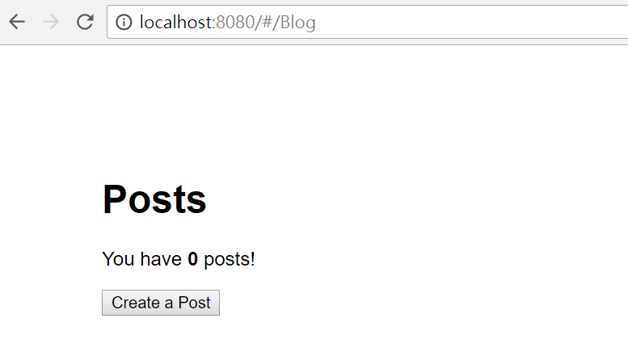
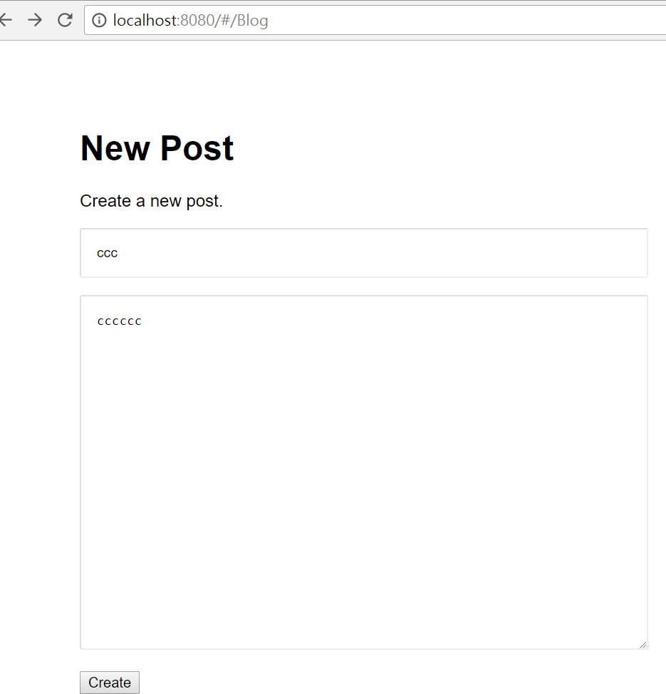

# vue-koablog

下載專案

```
$ git clone https://github.com/ccckmit/montana.git
$ cd montana
```

開新終端機切到 montana 執行 MongoDB 伺服器

```
$ cd vue-koablog
$ mkdir db
$ mongod --dbpath db
```

開新終端機執行 web 伺服器

```
$ cd vue-koablog
$ cd server
$ npm i
$ node blogServer
```

開新終端機執行 npm run dev 進行前端開發

```
$ cd vue-koablog
$ npm i
$ npm run dev
```

然後觀看 http://localhost:8080/#/Blog

畫面 1



畫面 2


畫面 3



## Build Setup

``` bash
# install dependencies
npm install

# serve with hot reload at localhost:8080
npm run dev

# build for production with minification
npm run build

# build for production and view the bundle analyzer report
npm run build --report

# run unit tests
npm run unit

# run e2e tests
npm run e2e

# run all tests
npm test
```

For a detailed explanation on how things work, check out the [guide](http://vuejs-templates.github.io/webpack/) and [docs for vue-loader](http://vuejs.github.io/vue-loader).
